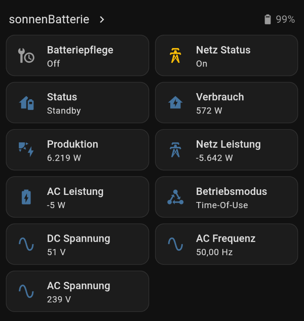
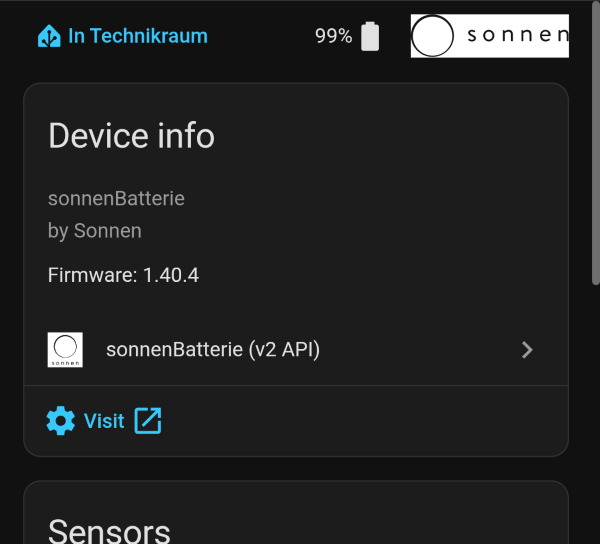
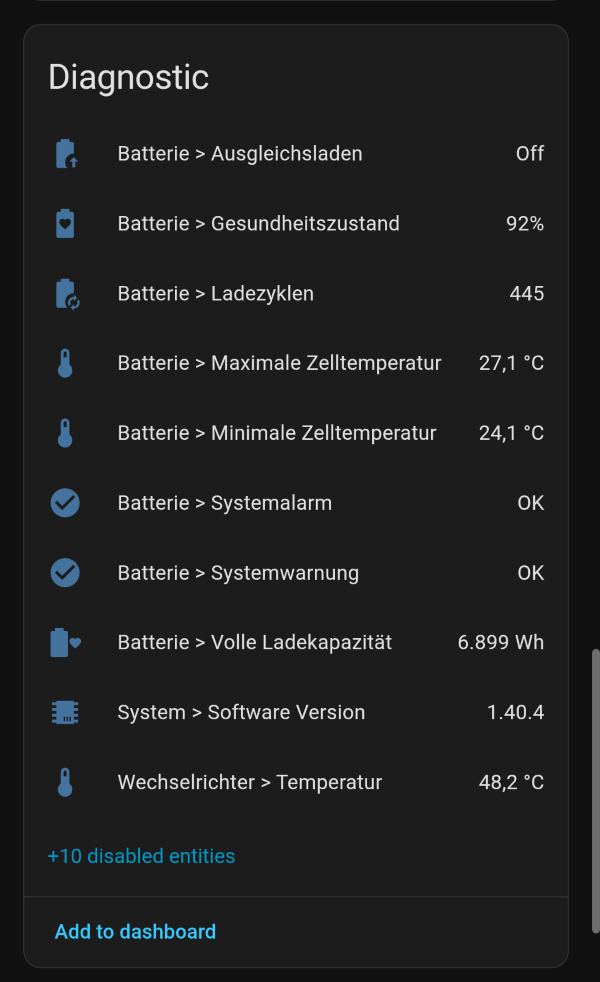
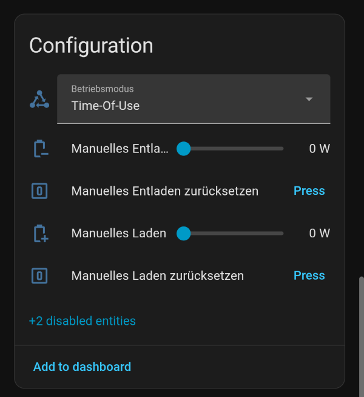

# ☀️🔋 sonnenBatterie (v2 API) – Home Assistant Integration

Home Assistant custom integration for sonnenBatterie systems that expose the modern token-based `/api/v2` interface (the one documented under **Dashboard → Software Integration**).

> [!NOTE]
> This repository is my fork from [Leonhard-Schwarz/ha_sonnenbatterie_v2](https://github.com/Leonhard-Schwarz/ha_sonnenbatterie_v2).
> Its main purpose is to introduce configurable polling intervals for status, diagnostic and configuration data, and to make power meter sensors optional.
> And it may include other local patches, custom changes not present upstream.

## 📖 Overview

The integration supports:

- Live monitoring of status, battery and inverter data
- Battery state and health values
- Optional power meter sensors
- Control features when write access is enabled on the battery

## ✅ Requirements

- Home Assistant **2025.5.0** or newer
- A sonnenBatterie reachable on your LAN with the **local API read access** enabled
- An **Auth-Token** (Battery Dashboard → *Software Integration*)
- For control features: **write access** enabled on the battery

## 📦 Installation

### Via HACS (custom repository)

The button above pre-fills this repository in HACS — then just **Download** and restart. Or add it manually:

1. HACS → ⋮ (top right) → **Custom repositories**
2. Repository: `https://github.com/rivengh/ha_sonnenbatterie_v2`
   Category: **Integration**
3. Add, then search for **sonnenBatterie (v2 API)** and **Download**
4. **Restart Home Assistant**

### Manual

Copy `custom_components/sonnenbatterie_v2/` into your `<config>/custom_components/`
folder and restart Home Assistant.

## ⚙️ Setup

> [!IMPORTANT]
> The integration must be **installed** (see above) and Home Assistant restarted before this button works.

Or add it manually: **Settings** → **Devices & Services** → **Add Integration** → *sonnenBatterie (v2 API)*

### 🛠️ Configuration Options

The initial setup dialogue includes the following options:

 Field | Required | Description
 --- | --- | ---
 Host | Yes | Battery IP address or hostname, e.g. `192.168.178.48`
 Token | Yes | Auth token from *Dashboard → Software Integration*
 Scan interval | No | Regular polling interval for status sensors in seconds. Default: `30`.
 Diagnostic scan interval | No | Polling interval for diagnostic/advanced sensors. Default: `300`.
 Configuration scan interval | No | Polling interval for configuration-related sensors. Default: `3600`.
 Expose power meter sensors | No | Toggle power meter entities. Default: `off`.

When reconfiguring an existing entry, the same fields are shown again and the configuration is updated in place.

## 📊 Monitoring Sensor Entities

This chapter provides a list of currently exposed monitoring sensor entities.

The monitoring sensors are grouped into three categories by their associated coordinator. This allows for different polling intervals to be set for each category.

- Status sensors
- Diagnostic sensors
- Configuration-related sensors

### 📈 Status Sensors

The status sensors are managed by the status coordinator, whose polling interval is configured using the `Scan Interval` option.

Sensor | Unit | API endpoint | Field | Enabled by default
--- | ---: | --- | --- | :---:
Battery state | — | Derived from `/api/v2/status` | `BatteryCharging`, `BatteryDischarging` | Yes
Consumption | W | `/api/v2/status` | `Consumption_W` | Yes
Average consumption | W | `/api/v2/status` | `Consumption_Avg` | No
Production | W | `/api/v2/status` | `Production_W` | Yes
Grid power | W | `/api/v2/status` | `GridFeedIn_W` | Yes
Grid export | W | `/api/v2/status` | `GridFeedIn_W` | No
Grid import | W | `/api/v2/status` | `GridFeedIn_W` | No
AC power | W | `/api/v2/status` | `Pac_total_W` | Yes
AC charge | W | `/api/v2/status` | `Pac_total_W` | No
AC discharge | W | `/api/v2/status` | `Pac_total_W` | No
User state of charge | % | `/api/v2/status` | `USOC` | Yes
Relative state of charge | % | `/api/v2/status` | `RSOC` | No
Remaining capacity | Wh | `/api/v2/status` | `RemainingCapacity_W` or `RemainingCapacity_Wh` | s
Operating mode | — | `/api/v2/status` | `OperatingMode` | Yes
Battery voltage | V | `/api/v2/status` | `Ubat` | Yes
AC frequency | Hz | `/api/v2/status` | `Fac` | Yes
AC voltage | V | `/api/v2/status` | `Uac` | Yes
Backup buffer | % | `/api/v2/status` | `BackupBuffer` | Yes

### 🔍 Diagnostic Sensors

The diagnostic sensors are managed by the diagnostic coordinator, whose polling interval is configured using the `Diagnostic scan interval` option.

Sensor | Unit | API endpoint | Field | Enabled by default
--- | ---: | --- | --- | :---:
Inverter temperature | °C | `/api/v2/inverter` | `tmax` | Yes
Inverter PV power | W | `/api/v2/inverter` | `ppv` | No
Inverter PV voltage | V | `/api/v2/inverter` | `upv` | No
Inverter PV current | A | `/api/v2/inverter` | `ipv` | No
Battery cycles | — | `/api/v2/battery` | `cyclecount` | Yes
Battery full-charge capacity | Wh | `/api/v2/battery` | `fullchargecapacitywh` | No
Battery system DC voltage | V | `/api/v2/battery` | `systemdcvoltage` | No
Battery system DC current | A | `/api/v2/battery` | `systemcurrent` | No
Maximum battery-cell temperature | °C | `/api/v2/battery` | `maximumcelltemperature` | No
Minimum battery-cell temperature | °C | `/api/v2/battery` | `minimumcelltemperature` | No
Maximum battery-cell voltage | V | `/api/v2/battery` | `maximumcellvoltage` | No
Minimum battery-cell voltage | V | `/api/v2/battery` | `minimumcellvoltage` | No
Battery state of health | % | Derived | `state_of_health_pct` | Yes

### ⚡ Dynamic power-meter sensors

> [!NOTE]
> These sensors are only available when enabled in configuration.

The dynamic power-meter sensors are managed by the diagnostic coordinator, whose polling interval is configured using the `Diagnostic scan interval` option.

Sensor | Unit | API endpoint | Field | Enabled by default
--- | ---: | --- | --- | :---:
Total power | W | `/api/v2/powermeter` | `w_total` | No
L1/L2/L3 power | W | `/api/v2/powermeter` | `w_l1`, `w_l2`, `w_l3` | No
L1/L2/L3 current | A | `/api/v2/powermeter` | `a_l1`, `a_l2`, `a_l3` | No
L1/L2/L3 voltage | V | `/api/v2/powermeter` | `v_l1_n`, `v_l2_n`, `v_l3_n` | No
Imported energy | kWh | `/api/v2/powermeter` | `kwh_imported` | No
Exported energy | kWh | `/api/v2/powermeter` | `kwh_exported` | No

### ⚙️ Configuration sensors

The configuration sensors are managed by the configuration coordinator, whose polling interval is configured using the `Configuration scan interval` option.

Sensor | Unit | API endpoint | Field | Enabled by default
--- | ---: | --- | --- | :---:
System module count | — | `/api/v2/configurations` | `IC_BatteryModules` | No
System inverter maximum power | W | `/api/v2/configurations` | `IC_InverterMaxPower_w` | Yes
System software version | — | `/api/v2/configurations` | `DE_Software` | Yes
System installed capacity | Wh | Derived from `/api/v2/configurations` | `IC_BatteryModules` * `CM_MarketingModuleCapacity` | No

## 🎛️ Control Entities

This chapter provides a list of currently exposed control entities.

**Control** (requires write access on the battery): operating mode (select),
forced charge / forced discharge (sliders), battery reserve (slider) and reset
buttons. *Time-of-Use schedule and standby are not implemented yet.*

## ⚠️ Known limitations

- Only the v2 API is supported
- Some battery-specific features depend on firmware support
- Time-of-Use schedules and standby controls are not yet implemented

## 🙏 Credits

- Forked from [Leonhard-Schwarz/ha_sonnenbatterie_v2](https://github.com/Leonhard-Schwarz/ha_sonnenbatterie_v2)
- Inspired by [weltmeyer/ha_sonnenbatterie](https://github.com/weltmeyer/ha_sonnenbatterie)

## 📄 License

This project is distributed under the terms of the repository license. Please check the repository for the full license text.

## 🖼️ Screenshots

Sensors Dashboard | Device Info
--- | ---
 | 

Diagnostic | Controls
--- | ---
 | 
